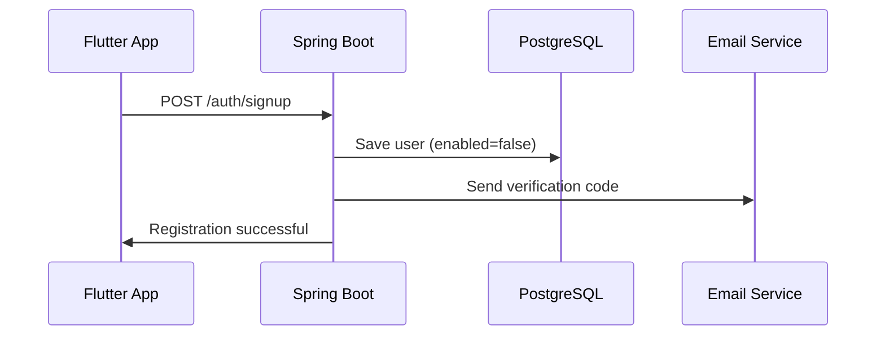
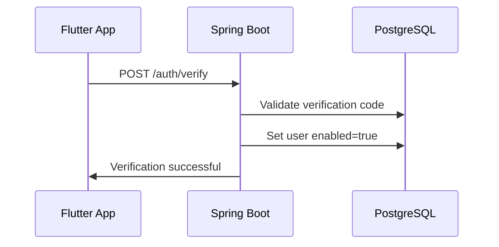
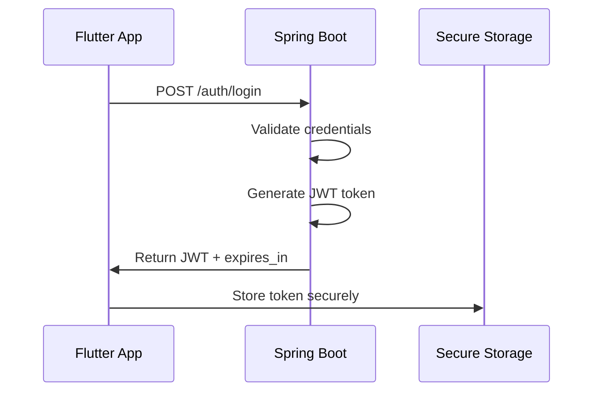
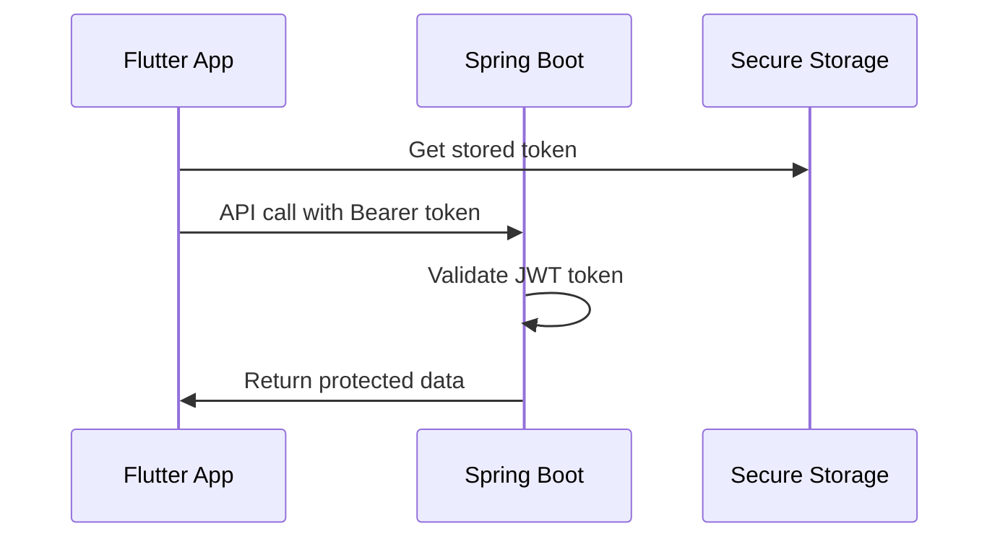

# JWT Authentication System - Flutter & Spring Boot

A complete JWT-based authentication system with email verification, built with Flutter (mobile) and Spring Boot (backend).

## 📋 Table of Contents
- [Features](#features)
- [Architecture Overview](#architecture-overview)
- [Authentication Flow](#authentication-flow)
- [Tech Stack](#tech-stack)
- [Setup Instructions](#setup-instructions)
- [API Endpoints](#api-endpoints)
- [Security Features](#security-features)
- [Project Structure](#project-structure)
- [Contributing](#contributing)

## ✨ Features

### Mobile (Flutter)
- ✅ User Registration with Email Verification
- ✅ Secure Login/Logout System
- ✅ JWT Token Management
- ✅ Encrypted Local Storage
- ✅ Responsive UI Design
- ✅ Error Handling & Validation
- ✅ State Management with Provider
- ✅ Biometric Storage Protection

### Backend (Spring Boot)
- ✅ JWT Token Generation & Validation
- ✅ Email Verification System
- ✅ Password Encryption (BCrypt)
- ✅ PostgreSQL Database Integration
- ✅ Transaction Management
- ✅ RESTful API Design
- ✅ Error Handling & Validation
- ✅ Email Service Integration

## 🏗️ Architecture Overview

```
┌─────────────────┐    HTTP/HTTPS     ┌─────────────────┐
│                 │ ──────────────────> │                 │
│  Flutter App    │                    │  Spring Boot    │
│  (Mobile)       │ <────────────────── │  (Backend)      │
│                 │    JWT Tokens      │                 │
└─────────────────┘                    └─────────────────┘
         │                                       │
         │                                       │
         ▼                                       ▼
┌─────────────────┐                    ┌─────────────────┐
│ Secure Storage  │                    │  PostgreSQL     │
│ (Encrypted)     │                    │  Database       │
└─────────────────┘                    └─────────────────┘
```

## 🔐 Authentication Flow

### 1. Registration Process


### 2. Email Verification


### 3. Login & Token Generation


### 4. Protected API Calls


## 🛠️ Tech Stack

### Frontend (Mobile)
- **Framework:** Flutter 3.x
- **State Management:** Provider Pattern
- **HTTP Client:** Dio
- **Secure Storage:** flutter_secure_storage
- **UI Components:** Material Design 3

### Backend
- **Framework:** Spring Boot 3.x
- **Security:** Spring Security + JWT
- **Database:** PostgreSQL
- **ORM:** Hibernate/JPA
- **Email:** JavaMail API
- **Password Hashing:** BCrypt

### Database Schema
```sql
CREATE TABLE users (
    id SERIAL PRIMARY KEY,
    username VARCHAR(50) UNIQUE NOT NULL,
    email VARCHAR(100) UNIQUE NOT NULL,
    password VARCHAR(255) NOT NULL,
    enabled BOOLEAN DEFAULT FALSE,
    verification_code VARCHAR(6),
    verification_expiration TIMESTAMP
);
```

## 🚀 Setup Instructions

### Prerequisites
- Flutter SDK 3.0+
- Java 17+
- PostgreSQL 13+
- IDE (VS Code, IntelliJ IDEA)

### Backend Setup
1. **Clone the repository**
   ```bash
   git clone https://github.com/your-username/jwt-auth-system.git
   cd jwt-auth-system/backend
   ```

2. **Configure database**
   ```properties
   # application.properties
   spring.datasource.url=jdbc:postgresql://localhost:5432/jwt_auth_db
   spring.datasource.username=your_username
   spring.datasource.password=your_password
   
   # JWT Configuration
   jwt.secret=your-256-bit-secret-key
   jwt.expiration=3600000
   
   # Email Configuration
   spring.mail.host=smtp.gmail.com
   spring.mail.username=your-email@gmail.com
   spring.mail.password=your-app-password
   ```

3. **Run the application**
   ```bash
   ./mvnw spring-boot:run
   ```

### Mobile Setup
1. **Navigate to Flutter project**
   ```bash
   cd jwt-auth-system/mobile
   ```

2. **Install dependencies**
   ```bash
   flutter pub get
   ```

3. **Configure API base URL**
   ```dart
   // main.dart
   dio.options.baseUrl = 'http://10.0.2.2:8080/auth'; // Android Emulator
   // dio.options.baseUrl = 'http://localhost:8080/auth'; // iOS Simulator
   // dio.options.baseUrl = 'http://your-ip:8080/auth'; // Physical Device
   ```

4. **Run the application**
   ```bash
   flutter run
   ```

## 📡 API Endpoints

### Authentication Endpoints

| Method | Endpoint | Description | Request Body | Response |
|--------|----------|-------------|--------------|-----------|
| POST | `/auth/signup` | User registration | `{email, username, password}` | `User object` |
| POST | `/auth/verify` | Email verification | `{email, verificationCode}` | `Success message` |
| POST | `/auth/login` | User login | `{email, password}` | `{token, expiresIn}` |
| POST | `/auth/resend` | Resend verification code | `?email=user@example.com` | `Success message` |

### Example Requests

**Registration:**
```json
POST /auth/signup
{
  "username": "john_doe",
  "email": "john@example.com",
  "password": "securePassword123"
}
```

**Login:**
```json
POST /auth/login
{
  "email": "john@example.com",
  "password": "securePassword123"
}

Response:
{
  "token": "eyJhbGciOiJIUzI1NiJ9...",
  "expiresIn": 3600000
}
```

## 🔒 Security Features

### JWT Token Security
- **Algorithm:** HMAC SHA-256
- **Expiration:** Configurable (default: 1 hour)
- **Claims:** Subject (email), issued time, expiration time
- **Signature:** Verified with secret key

### Password Security
- **Hashing:** BCrypt with salt
- **Strength:** Minimum 6 characters
- **Storage:** Never stored in plain text

### Mobile Security
- **Storage:** Encrypted secure storage
- **Network:** HTTPS only
- **Biometric:** Optional biometric protection
- **Auto-logout:** On token expiration

### Backend Security
- **CORS:** Configured for mobile origins
- **Input Validation:** DTO validation
- **SQL Injection:** Protected by JPA/Hibernate
- **Transaction Management:** @Transactional annotations

## 📁 Project Structure

### Backend Structure
```
src/main/java/com/zeynalabidin/authentication/
├── controller/
│   └── AuthenticationController.java
├── service/
│   ├── AuthenticationService.java
│   ├── JwtService.java
│   └── EmailService.java
├── model/
│   └── User.java
├── dto/
│   ├── LoginUserDto.java
│   ├── RegisterUserDto.java
│   └── VerifyUserDto.java
├── repository/
│   └── UserRepository.java
└── config/
    └── SecurityConfig.java
```

### Mobile Structure
```
lib/
├── main.dart
├── home_view.dart
└── auth/
    ├── provider/
    │   └── auth_provider.dart
    ├── service/
    │   └── auth_service.dart
    └── view/
        ├── login/
        │   ├── login_view.dart
        │   └── login_view_model.dart
        ├── signup/
        │   ├── signup_view.dart
        │   └── signup_view_model.dart
        └── verify/
            ├── verify_view.dart
            └── verify_view_model.dart
```

## 🤝 Contributing

1. Fork the repository
2. Create your feature branch (`git checkout -b feature/AmazingFeature`)
3. Commit your changes (`git commit -m 'Add some AmazingFeature'`)
4. Push to the branch (`git push origin feature/AmazingFeature`)
5. Open a Pull Request

### Development Guidelines
- Follow clean code principles
- Write comprehensive tests
- Update documentation
- Follow existing code style
- Use meaningful commit messages

## 📄 License

This project is licensed under the MIT License - see the [LICENSE](LICENSE) file for details.

## 👤 Author

**Zeynal Abidin Ünlü**
- GitHub: [@zeynalabidin](https://github.com/zeynalabidinunlu)
- E-posta: zeynalabidinunlu@gmail.com

## 🙏 Acknowledgments

- Flutter team for the amazing framework
- Spring Boot team for the robust backend framework
- JWT.io for JWT implementation guides
- Material Design team for UI components

---

# JWT Kimlik Doğrulama Sistemi - Flutter & Spring Boot

Flutter (mobil) ve Spring Boot (backend) ile e-posta doğrulamalı, JWT tabanlı kapsamlı kimlik doğrulama sistemi.

## 📋 İçindekiler
- [Özellikler](#özellikler)
- [Mimari Genel Bakış](#mimari-genel-bakış)
- [Kimlik Doğrulama Akışı](#kimlik-doğrulama-akışı)
- [Teknoloji Yığını](#teknoloji-yığını)
- [Kurulum Talimatları](#kurulum-talimatları)
- [API Uç Noktaları](#api-uç-noktaları)
- [Güvenlik Özellikleri](#güvenlik-özellikleri)
- [Proje Yapısı](#proje-yapısı)
- [Katkıda Bulunma](#katkıda-bulunma)

## ✨ Özellikler

### Mobil (Flutter)
- ✅ E-posta Doğrulamalı Kullanıcı Kaydı
- ✅ Güvenli Giriş/Çıkış Sistemi
- ✅ JWT Token Yönetimi
- ✅ Şifrelenmiş Yerel Depolama
- ✅ Duyarlı UI Tasarımı
- ✅ Hata İşleme ve Doğrulama
- ✅ Provider ile Durum Yönetimi
- ✅ Biyometrik Depolama Koruması

### Backend (Spring Boot)
- ✅ JWT Token Oluşturma ve Doğrulama
- ✅ E-posta Doğrulama Sistemi
- ✅ Şifre Şifreleme (BCrypt)
- ✅ PostgreSQL Veritabanı Entegrasyonu
- ✅ Transaction Yönetimi
- ✅ RESTful API Tasarımı
- ✅ Hata İşleme ve Doğrulama
- ✅ E-posta Servisi Entegrasyonu

## 🏗️ Mimari Genel Bakış

```
┌─────────────────┐    HTTP/HTTPS     ┌─────────────────┐
│                 │ ──────────────────> │                 │
│  Flutter App    │                    │  Spring Boot    │
│  (Mobil)        │ <────────────────── │  (Backend)      │
│                 │    JWT Tokens      │                 │
└─────────────────┘                    └─────────────────┘
         │                                       │
         │                                       │
         ▼                                       ▼
┌─────────────────┐                    ┌─────────────────┐
│ Güvenli Depolama│                    │  PostgreSQL     │
│ (Şifrelenmiş)   │                    │  Veritabanı     │
└─────────────────┘                    └─────────────────┘
```

## 🔐 Kimlik Doğrulama Akışı

### 1. Kayıt İşlemi
1. **Kullanıcı Kaydı:** Kullanıcı e-posta, kullanıcı adı ve şifre girer
2. **Veri İşleme:** Backend şifreyi hash'ler ve veritabanına kaydeder (enabled=false)
3. **E-posta Gönderimi:** 6 haneli doğrulama kodu e-posta ile gönderilir
4. **Başarı Yanıtı:** Kayıt başarılı mesajı döner (henüz token yok)

### 2. E-posta Doğrulama
1. **Kod Girişi:** Kullanıcı e-postadan aldığı 6 haneli kodu girer
2. **Kod Doğrulama:** Backend kodu kontrol eder ve süre kontrolü yapar
3. **Hesap Aktivasyonu:** Doğru kod ise user.enabled = true yapılır
4. **Kod Temizleme:** Doğrulama kodu veritabanından silinir

### 3. Giriş ve Token Oluşturma
1. **Giriş Denemesi:** Kullanıcı e-posta ve şifre ile giriş yapar
2. **Hesap Kontrolü:** Backend user.enabled kontrolü yapar
3. **Kimlik Doğrulama:** E-posta ve şifre doğruluğu kontrol edilir
4. **Token Oluşturma:** Başarılı ise JWT token oluşturulur
5. **Token Dönüşü:** Token ve süre bilgisi mobile app'e döner
6. **Güvenli Saklama:** Token şifrelenmiş storage'da saklanır

### 4. Korumalı API Çağrıları
1. **Token Alma:** Her API çağrısı öncesi token storage'dan alınır
2. **Header Ekleme:** Authorization header'ına Bearer token eklenir
3. **Backend Doğrulama:** Token imzası ve süre kontrolü yapılır
4. **Yanıt Dönüşü:** Geçerli token ise istenen veri döner

## 🛠️ Teknoloji Yığını

### Frontend (Mobil)
- **Framework:** Flutter 3.x
- **Durum Yönetimi:** Provider Pattern
- **HTTP İstemci:** Dio
- **Güvenli Depolama:** flutter_secure_storage
- **UI Bileşenleri:** Material Design 3

### Backend
- **Framework:** Spring Boot 3.x
- **Güvenlik:** Spring Security + JWT
- **Veritabanı:** PostgreSQL
- **ORM:** Hibernate/JPA
- **E-posta:** JavaMail API
- **Şifre Hash'leme:** BCrypt

## 🚀 Kurulum Talimatları

### Ön Gereksinimler
- Flutter SDK 3.0+
- Java 17+
- PostgreSQL 13+
- IDE (VS Code, IntelliJ IDEA)

### Backend Kurulumu
1. **Depoyu klonlayın**
   ```bash
   git clone https://github.com/kullanici-adi/jwt-auth-system.git
   cd jwt-auth-system/backend
   ```

2. **Veritabanını yapılandırın**
   ```properties
   # application.properties
   spring.datasource.url=jdbc:postgresql://localhost:5432/jwt_auth_db
   spring.datasource.username=kullanici_adi
   spring.datasource.password=sifre
   
   # JWT Yapılandırması
   jwt.secret=256-bit-gizli-anahtar
   jwt.expiration=3600000
   
   # E-posta Yapılandırması
   spring.mail.host=smtp.gmail.com
   spring.mail.username=eposta@gmail.com
   spring.mail.password=uygulama-sifresi
   ```

3. **Uygulamayı çalıştırın**
   ```bash
   ./mvnw spring-boot:run
   ```

### Mobil Kurulum
1. **Flutter projesine gidin**
   ```bash
   cd jwt-auth-system/mobile
   ```

2. **Bağımlılıkları yükleyin**
   ```bash
   flutter pub get
   ```

3. **API temel URL'ini yapılandırın**
   ```dart
   // main.dart
   dio.options.baseUrl = 'http://10.0.2.2:8080/auth'; // Android Emulator
   // dio.options.baseUrl = 'http://localhost:8080/auth'; // iOS Simulator
   // dio.options.baseUrl = 'http://ip-adresiniz:8080/auth'; // Fiziksel Cihaz
   ```

4. **Uygulamayı çalıştırın**
   ```bash
   flutter run
   ```

## 📡 API Uç Noktaları

### Kimlik Doğrulama Uç Noktaları

| Metod | Uç Nokta | Açıklama | İstek Gövdesi | Yanıt |
|-------|----------|----------|---------------|--------|
| POST | `/auth/signup` | Kullanıcı kaydı | `{email, username, password}` | `User nesnesi` |
| POST | `/auth/verify` | E-posta doğrulama | `{email, verificationCode}` | `Başarı mesajı` |
| POST | `/auth/login` | Kullanıcı girişi | `{email, password}` | `{token, expiresIn}` |
| POST | `/auth/resend` | Doğrulama kodu tekrar gönder | `?email=user@example.com` | `Başarı mesajı` |

## 🔒 Güvenlik Özellikleri

### JWT Token Güvenliği
- **Algoritma:** HMAC SHA-256
- **Süre:** Yapılandırılabilir (varsayılan: 1 saat)
- **İçerik:** Subject (e-posta), çıkış zamanı, bitiş zamanı
- **İmza:** Gizli anahtar ile doğrulanır

### Şifre Güvenliği
- **Hash'leme:** Salt ile BCrypt
- **Güçlü:** Minimum 6 karakter
- **Depolama:** Hiçbir zaman düz metin olarak saklanmaz

### Mobil Güvenlik
- **Depolama:** Şifrelenmiş güvenli depolama
- **Ağ:** Sadece HTTPS
- **Biyometrik:** Opsiyonel biyometrik koruma
- **Otomatik çıkış:** Token süresi dolduğunda

## 📁 Proje Yapısı

### Backend Yapısı
```
src/main/java/com/zeynalabidin/authentication/
├── controller/
│   └── AuthenticationController.java
├── service/
│   ├── AuthenticationService.java
│   ├── JwtService.java
│   └── EmailService.java
├── model/
│   └── User.java
├── dto/
│   ├── LoginUserDto.java
│   ├── RegisterUserDto.java
│   └── VerifyUserDto.java
├── repository/
│   └── UserRepository.java
└── config/
    └── SecurityConfig.java
```

### Mobil Yapısı
```
lib/
├── main.dart
├── home_view.dart
└── auth/
    ├── provider/
    │   └── auth_provider.dart
    ├── service/
    │   └── auth_service.dart
    └── view/
        ├── login/
        │   ├── login_view.dart
        │   └── login_view_model.dart
        ├── signup/
        │   ├── signup_view.dart
        │   └── signup_view_model.dart
        └── verify/
            ├── verify_view.dart
            └── verify_view_model.dart
```

## 🤝 Katkıda Bulunma

1. Depoyu fork edin
2. Feature branch'inizi oluşturun (`git checkout -b feature/HarikaOzellik`)
3. Değişikliklerinizi commit edin (`git commit -m 'Harika özellik ekle'`)
4. Branch'inizi push edin (`git push origin feature/HarikaOzellik`)
5. Pull Request açın

### Geliştirme Kılavuzları
- Temiz kod prensiplerini takip edin
- Kapsamlı testler yazın
- Dokümantasyonu güncelleyin
- Mevcut kod stilini takip edin
- Anlamlı commit mesajları kullanın

## 📄 Lisans

Bu proje MIT Lisansı altında lisanslanmıştır - detaylar için [LICENSE](LICENSE) dosyasına bakın.

## 👤 Yazar

**Zeynal Abidin Ünlü**
- GitHub: [@zeynalabidin](https://github.com/zeynalabidinunlu)
- E-posta: zeynalabidinunlu@gmail.com

## 🙏 Teşekkürler

- Harika framework için Flutter ekibine
- Sağlam backend framework için Spring Boot ekibine
- JWT implementasyon kılavuzları için JWT.io'ya
- UI bileşenleri için Material Design ekibine
